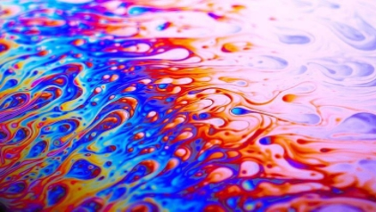

**Vector Promedio, Matriz de Covarianza y Correlación** 

- Leer una imagen R, G, B. 
  - Calcular el color promedio. 
  - Matriz de covarianza. 
  - Matriz de correlación. 
- Probar para 3 imágenes e interpretar los resultados. 
- Para una de las imágenes: 
- Extraer 3 pixeles al azar. 
- Calcular su probabilidad de cercanía al color promedio 

**IMAGEN 1:  
**

* Tamaño: 720x480  

* El vector promedio es:  

` `[[0.6555878]  

` `[0.48650412]  

` `[0.71620631]]  

* La matriz de covarianza es:  

[[ 0.12017971  0.05735187 -0.0122049 ]   

[ 0.05735187  0.09365783  0.0532144 ]   

[-0.0122049   0.0532144   0.11285893]]  

* La matriz de correlación es:  

`          `R               G            B     

R  1.000000  0.122135 -0.998433 

G  0.122135  1.000000 -0.066401 

B -0.998433 -0.066401  1.000000 

* El pixel es: (514,266)  

` `[[0.92156863]  

` `[0.61568627]  

` `[0.77254902]]  

* La cercanía al color promedio es:  2.0622687448676484  

* El pixel es: (135,175)  

` `[[0.13333333]  

` `[0.        ]  

` `[0.95686275]]  

* La cercania al color promedio es:  0.15991503473293497  

* El pixel es: (71,176)  

` `[[0.4627451 ]  

` `[0.79215686]  

` `[0.90196078]]  

* La cercania al color promedio es:  0.5639572821535827  

* Los eigenvalores son:

[0.0206214 0.12828059 0.17779448]

* Los eigenvectores son:

O                 G                    R
            
[[ 0.48038766 -0.65655347  0.58151977]

 [-0.73067908  0.0671416   0.67941158]
 
 [ 0.4851142   0.75128526  0.44747589]]

* El porcentaje del total de la varianza para el eigenvalor 1 es: 6.31%

* El porcentaje del total de la varianza para el eigenvalor 2 es: 39.26%

* El porcentaje del total de la varianza para el eigenvalor 3 es: 54.42%

En esta imagen podemos observar que el color promedio es un morado claro. En la matriz de covarianza se puede observar que los componentes R, G, B si están correlacionados, y gracias a la matriz de correlación podemos ver que esa correlación es de 12% para el rojo-verde, -99% para el rojo-azul y -6% para el verde-azul. La correlación rojo-azul es la que tiene mayor correlación aunque es negativa, ya que la combinación de estos colores da morado, el cual es el color promedio, mientras que las relaciones rojo- verde y verde-azul tienen una correlación baja debido ya que estas combinaciones dan respectivamente amarillo y cyan, los cuales casi no están presentes en la imagen. 

Al analizar los 3 pixeles al azar, se puede ver que el que tiene mas cercanía al color promedio es el rosa, después le sigue es el azul claro, mientras que el azul oscuro es el mas lejano. 

**IMAGEN 2:  

* Tamaño: 1100x600  

* El vector promedio es:    

` `[[0.16362125]

` `[0.24579023]

` `[0.19278233]]  

* La matriz de covarianza es:  

[[ 0.0718461   0.0636648  -0.00437135]   

[ 0.0636648   0.0691936   0.00951601]  

[-0.00437135  0.00951601  0.02281596]] 

* La matriz de correlación es: 

`          `R               G              B 

R  1.000000  0.983511 -0.905537 

G  0.983511  1.000000 -0.813876 

B -0.905537 -0.813876  1.000000 

* Los eigenvalores son:

[0.13431133 0.00212393 0.02742039]

* Los eigenvectores son:

O                 G                    R
            
[[-0.71233976 -0.62285567 -0.3234546 ]

 [-0.70110897  0.6524792   0.28760582]
 
 [-0.03191048 -0.43164999  0.90147657]]
 

* El porcentaje del total de la varianza para el eigenvalor 1 es: 81.96%

* El porcentaje del total de la varianza para el eigenvalor 2 es: 1.29%

* El porcentaje del total de la varianza para el eigenvalor 3 es: 16.73%

En esta imagen podemos observar que el color promedio es un verde oscuro. En la matriz de covarianza se puede observar que los componentes R, G, B si están correlacionados, y gracias a la matriz de correlación podemos ver que esa correlación es de 98% para el rojo-verde, -90% para el rojo-azul y - 81% para el verde-azul. La correlación rojo-verde es la que tiene mayor correlación y es positiva, ya que la  combinación  de  estos  colores  da  amarillo  el  cual  predomina  sobre  todo  en  la  esquina  superior izquierda, mientras que la correlación rojo-azul es negativa ya que cuando el azul aumenta el rojo disminuye y el verde-azul tiene la correlación mas baja. 

**IMAGEN 3:  

* Tamaño: 1366x772  

*El vector promedio es:    
  

` `[[0.42683317]

` `[0.27475847]

` `[0.1187362 ]] 

* La matriz de covarianza es:  

[[ 0.14934905  0.00548443 -0.0260601 ]   

[ 0.00548443  0.07221118  0.00568012]  

[-0.0260601   0.00568012  0.03919703]]  

* La matriz de correlación es: 

`          `R               G               B 

R  1.000000 -0.349142 -0.932389 

G -0.349142  1.000000 -0.013174 

B -0.932389 -0.013174  1.000000 

* Los eigenvalores son:

[0.15540686 0.03220207 0.07314833]

* Los eigenvectores son:
 
O                 G                    R
[[ 0.97508325  0.22154042 -0.01151075]

 [ 0.04951571 -0.16677188  0.98475141]
 
 [-0.21624258  0.96078457  0.17358619]]

* El porcentaje del total de la varianza para el eigenvalor 1 es: 59.59%

* El porcentaje del total de la varianza para el eigenvalor 2 es: 12.34%

* El porcentaje del total de la varianza para el eigenvalor 3 es: 28.05%

En esta imagen se puede observar que el color promedio es un café. En la matriz de covarianza se puede observar que os componentes R, G, B si están correlacionados, mientras que en la matriz de correlación se puede ver que la correlación rojo-verde es de -34%, la rojo-azul es de -93% y la verde-azul es -1%, lo cual se puede interpretar como que la correlación rojo-azul es la que mas fuerte aunque sea negativa, mientras que la verde-azul es la que menos influye en la imagen. 
